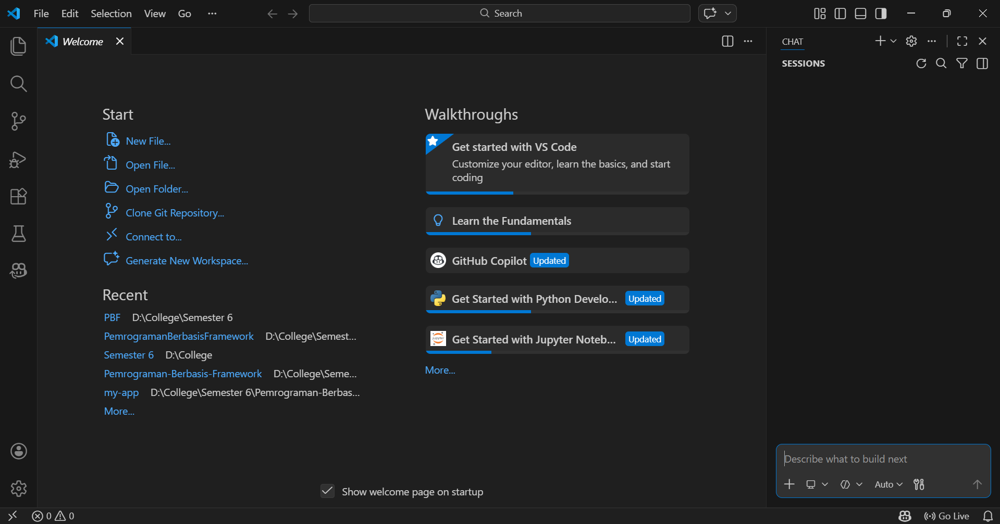
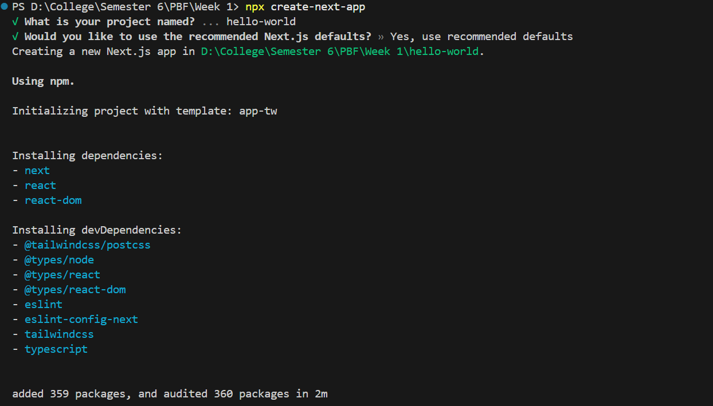
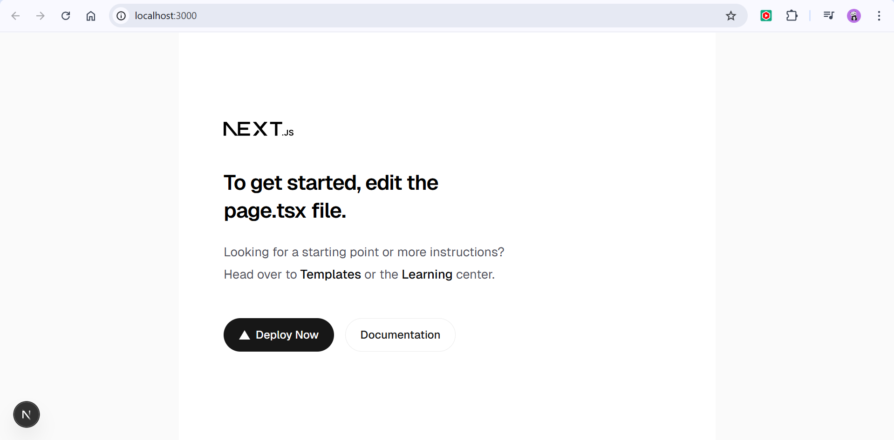
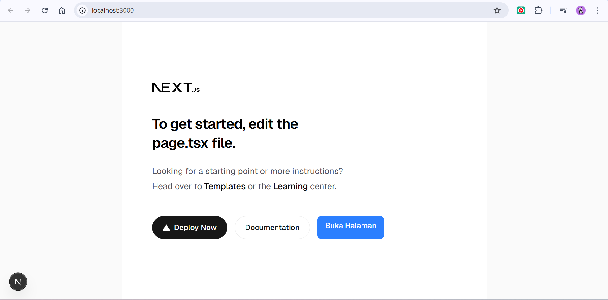
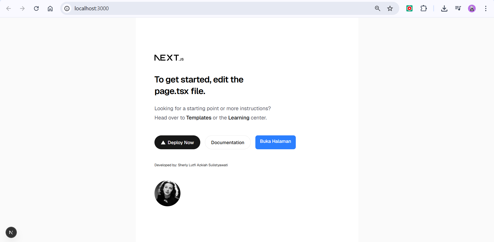

## Practicum Report

|  | Pemrograman Berbasis Framework 2026 |
|--|--|
| NIM |  2341720241|
| Nama |  Sherly Lutfi Azkiah Sulistyawati |
| Kelas | TI - 3I |
---

## Practicum 1 – Setting Up the Development Environment
### Question 1
**Explain the functions of Git, VS Code, and NodeJS that you installed in this practicum session!**
- Git is a version control system used to track changes in source code and manage code history. It helps developers collaborate and manage code using features like commit, push, pull, and merge.
- VS Code is a code editor used to write and edit programming code. It supports many programming languages and provides extensions for debugging, Git integration, and auto-completion.
- Node.js is a JavaScript runtime environment that allows JavaScript to run outside the browser. It is used to build scalable server-side and network applications.

### Question 2
**Provide screenshots showing that each of these tools has been successfully installed!**

## Practicum 2 – Creating First React Project using Next.js
### Question 1
**Explain the following terms: TypeScript, ESLint, Tailwind CSS, App Router, Import Alias, and Turbopack**
- TypeScript is a superset of JavaScript that adds static typing to help developers detect errors earlier and write more structured code.
- ESLint is a tool used to analyze code and detect problems or coding style issues in JavaScript or TypeScript.
- Tailwind CSS is a utility-first CSS framework used to quickly design responsive and modern user interfaces.
- App Router is a routing system in Next.js that manages navigation and page structure using the app directory.
- Import Alias is a feature that allows developers to use shorter and easier paths when importing files in a project.
- Turbopack is a fast bundler developed by Next.js to improve development performance and speed up project compilation.

### Question 2
**Explain the function of folders and files in the React project structure**
| Folder/File        | Function                                                                     |
| ------------------ | ---------------------------------------------------------------------------- |
| **app/**           | Contains the main pages and routing of the Next.js application.              |
| **public/**        | Stores static files such as images, icons, and other assets.                 |
| **node_modules/**  | Contains all dependencies and packages installed through npm.                |
| **package.json**   | Stores project information and the list of dependencies used in the project. |
| **next.config.js** | Configuration file used to customize Next.js settings.                       |
| **README.md**      | Contains documentation or information about the project.                     |

### Question 3
**Provide proof that the steps have been successfully completed**

## Practicum 3 — Adding React Component Button
### Question 1
**Provide screenshots showing that the steps were successfully completed**

## Practicum 4 — Writing Markup with JSX
### Question 1
**What is the function of the syntax user.imageUrl?**

user.imageUrl is used to access the image URL value from the user object and display it as the image source (src) in the  tag. This allows the profile picture to be displayed on the webpage.

### Question 2
**Provide proof that the steps have been successfully completed**
