## Practicum Report

|  | Pemrograman Berbasis Framework 2026 |
|--|--|
| NIM |  2341720241|
| Nama |  Sherly Lutfi Azkiah Sulistyawati |
| Kelas | TI - 3I |
---

### 1. Static Routing
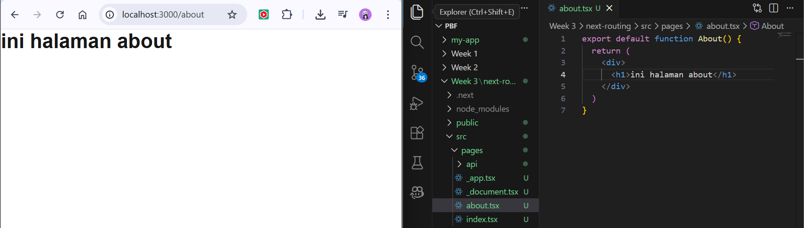

### 2. Folder Routing
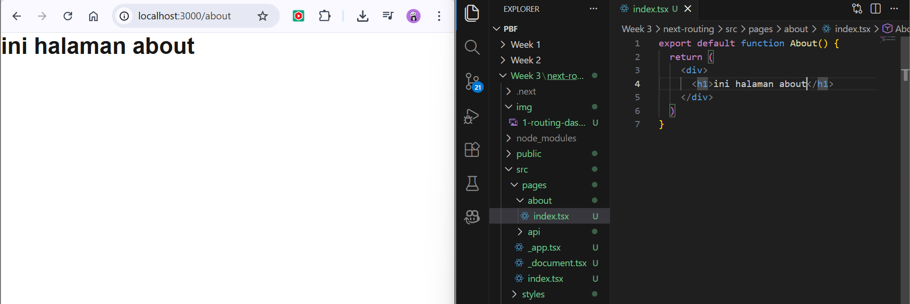

### 3. Nested Routing
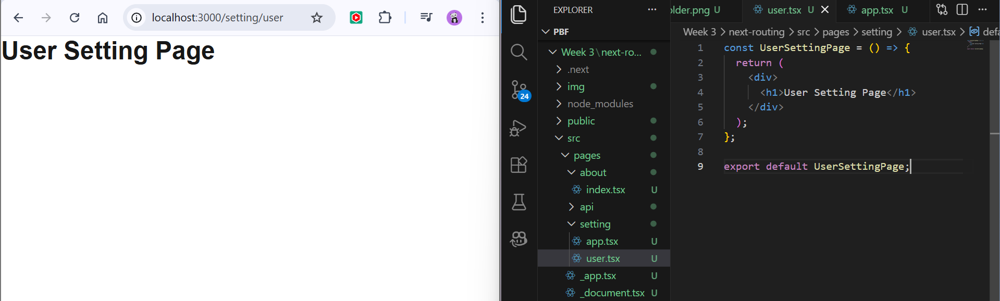
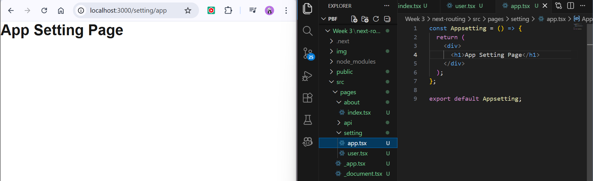
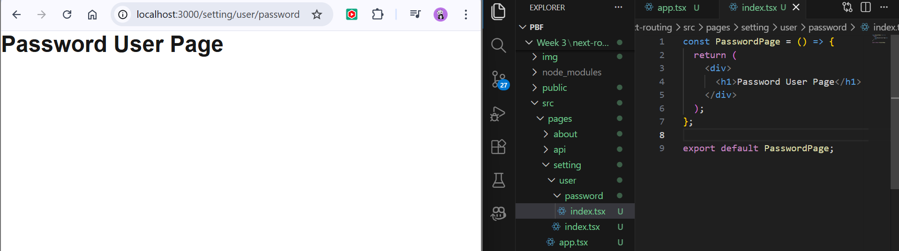

### 4. Dynamic Routing
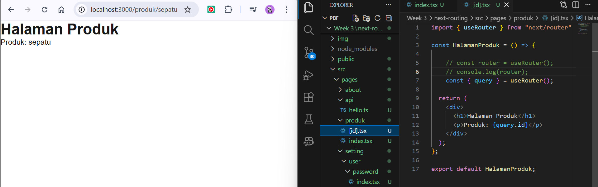

### 5. Navbar Component
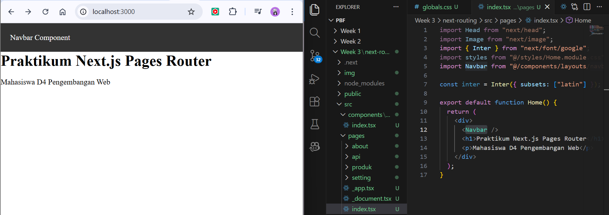
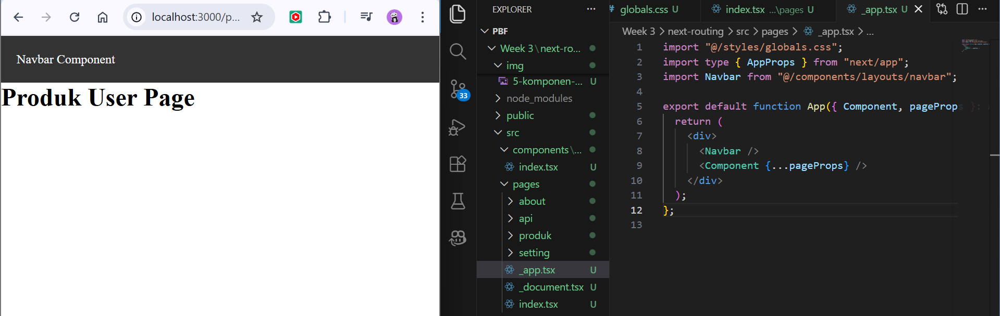

### 6. Layout Global (App Shell)
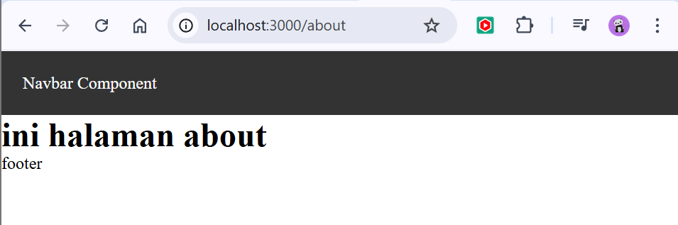

## Practical Tasks
### Task 1 – Routing
1. Create the following pages:
- /profile
- /profile/edit
2. Make sure the routing works without any errors.
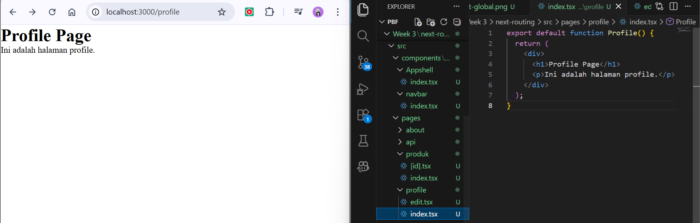
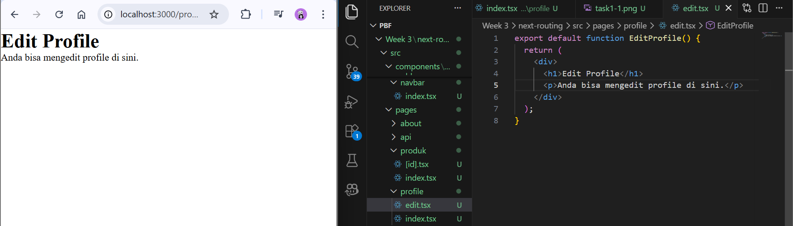

### Task 2 – Dynamic Routing
1. Create the following route:
2. /blog/[slug]
3. Display the slug value on the page.
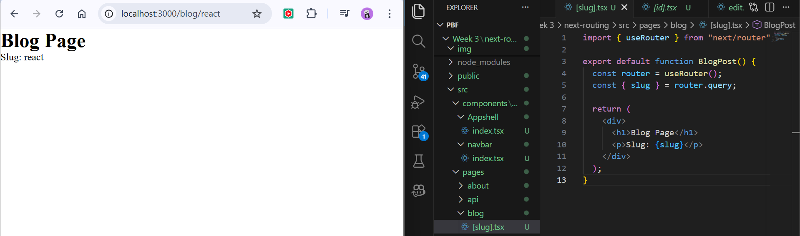
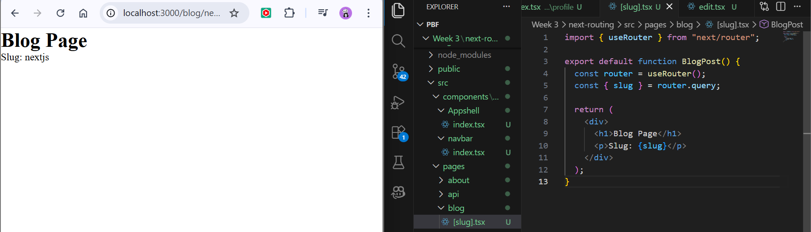

### Task 3 – Layout
1. Add a Footer to the AppShell.
2. The Footer must appear on all pages.

## Reflection Questions
**1. What is the difference between file-based routing and manual routing?**
- File-based routing determines the application routes automatically based on the file and folder structure in the project. For example, in Next.js, a file named pages/about.tsx will automatically create the route /about. Developers do not need to manually configure the routes.
- Manual routing requires developers to explicitly define routes in the code using a routing library such as React Router. Each route must be configured manually by specifying the path and the component that should be rendered.

**2. Why is dynamic routing important in web applications?**

Dynamic routing is important because it allows a single page template to handle multiple different data or content based on parameters in the URL. For example, a blog website can use one page such as /blog/[slug] to display many blog posts like /blog/react, /blog/javascript, or /blog/nextjs.

This approach makes the application more flexible, reduces code duplication, and allows content to be generated dynamically based on user requests.

**3. What are the advantages of using a global layout compared to calling components one by one?**

Using a global layout provides several advantages. First, it reduces code duplication because common components such as headers, footers, and navigation bars only need to be defined once. Second, it ensures a consistent design across all pages. Third, it makes the code easier to maintain and manage because shared components are centralized in one place instead of being repeated in multiple pages.
