## Practicum Report

|  | Pemrograman Berbasis Framework 2026 |
|--|--|
| NIM |  2341720241|
| Nama |  Sherly Lutfi Azkiah Sulistyawati |
| Kelas | TI - 3I |
---

### Step 1 – Run Project
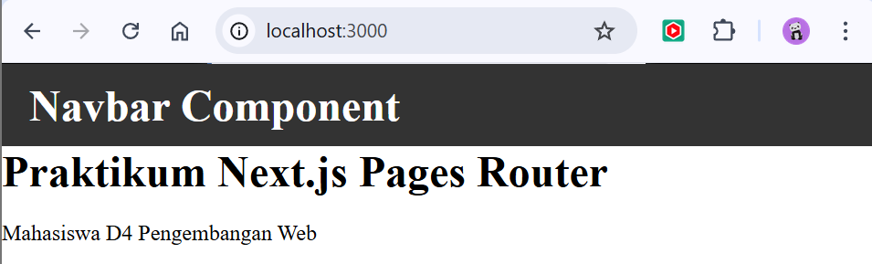

### Step 2 – Create Catch-All Route
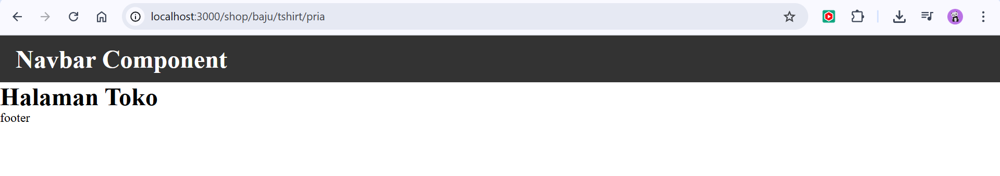

### Step 3 – Catch-All Route Testing
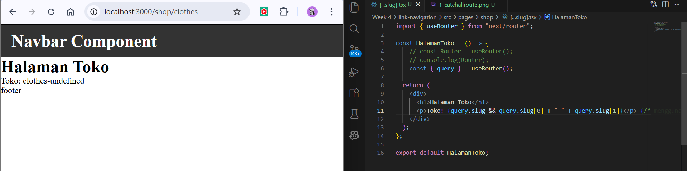
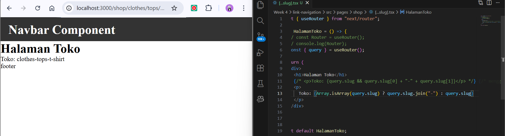

### Step 4 – Optional Catch-All Route
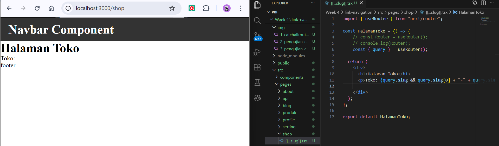

### Step 5 – Parameter Validation

### Step 6 – Create Login & Register Pages
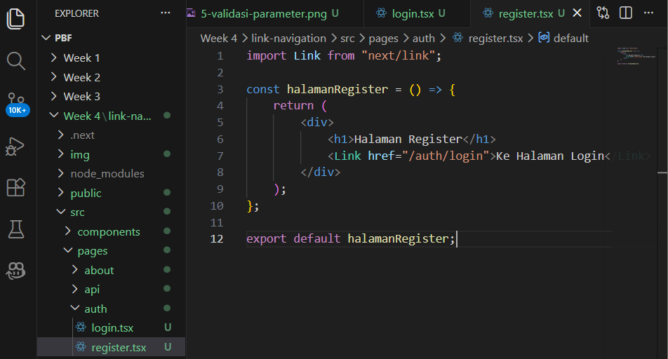

### Step 7 – Imperative Navigation (router.push)
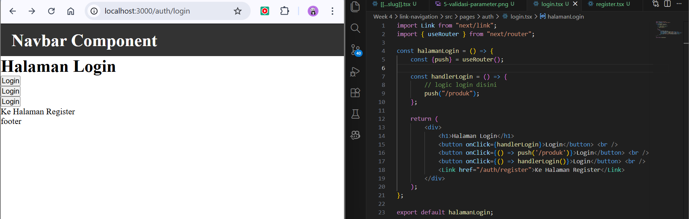

### Step 8 – Redirect Simulation (Not Logged In)
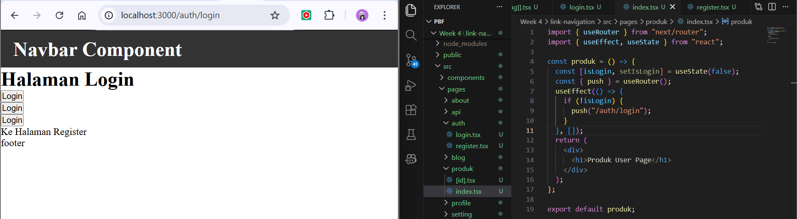

## Practical Tasks
### Task 1
- Create a catch-all route:
    - /category/[...slug].js
- Display all URL parameters in the form of a list.
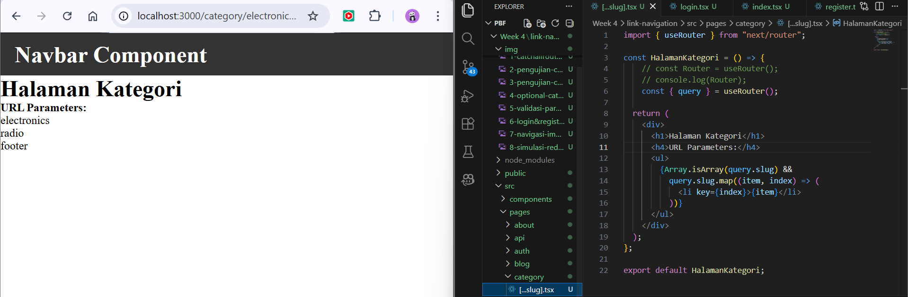

In this task, I created a catch-all route using the file [...slug].tsx in the category folder. This route allows the page to receive multiple parameters from the URL. The parameters are stored in the slug variable and displayed on the page as a list. For example, when accessing /category/electronics/radio, the page will show the values electronics and radio.

### Task 2
- Create navigation:
    - Login → Product (imperative navigation)
    - Login ↔ Register (using Link)
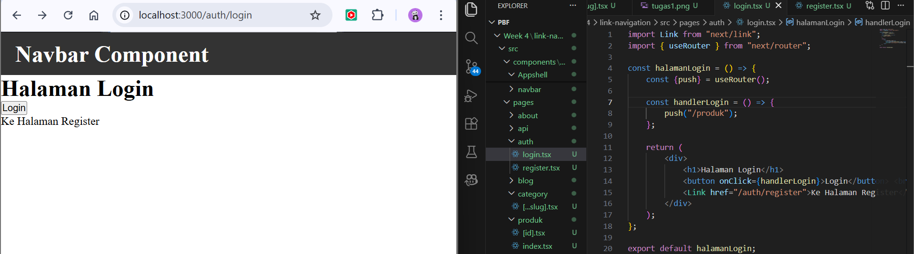
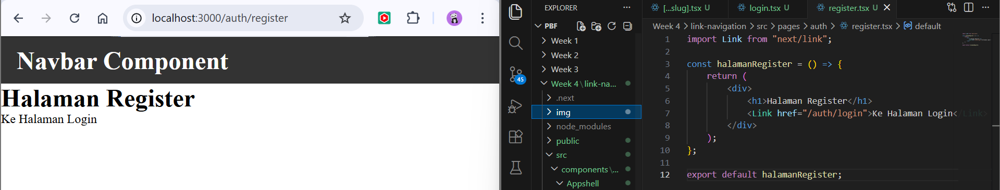
In this task, I implemented navigation between pages using two methods. The first method is imperative navigation using router.push() on the login page to move the user to the product page after clicking the login button. The second method uses the Link component to create navigation between the login and register pages without refreshing the page.

### Task 3
- Implement an automatic redirect to the login page if the user is not logged in.
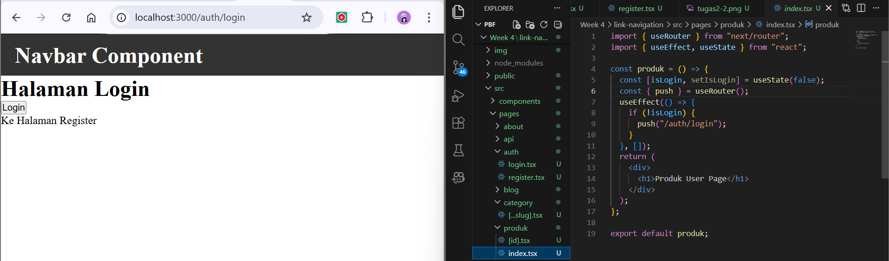

## Reflection Questions
**1. 1. What is the difference between [id].js and [...slug].js?**

| Feature             | `[id].js`          | `[...slug].js`                     |
| ------------------- | ------------------ | ---------------------------------- |
| Type                | Dynamic route      | Catch-all route                    |
| Parameters captured | Only one parameter | Multiple parameters                |
| Example URL         | `/product/1`       | `/category/electronics/laptop`     |
| Result              | `id = 1`           | `slug = ["electronics", "laptop"]` |

[id].js is used to capture a single dynamic parameter from the URL. Meanwhile, [...slug].js is used to capture multiple URL segments at once.

**2. Why is slug in the form of an array?**

The slug is an array because catch-all routing can capture multiple parts of the URL. Each segment of the URL becomes one element in the array. This allows the application to handle URLs with different levels of paths.

Example: /category/a/b/c → ["a", "b", "c"]

**3. When should we use Link and router.push()?**

**Link** should be used for navigation between pages through clickable links in the interface. **router.push()** should be used when navigation needs to happen programmatically, such as after a login process or after submitting a form.

**4. Why does Next.js navigation not refresh the page?**

Next.js uses client-side navigation, which means only the necessary parts of the page are updated without reloading the entire page. This makes the application faster and provides a smoother user experience.