## Practicum Report

|  | Pemrograman Berbasis Framework 2026 |
|--|--|
| NIM |  2341720241|
| Nama |  Sherly Lutfi Azkiah Sulistyawati |
| Kelas | TI - 3I |
---

### 1. Global CSS
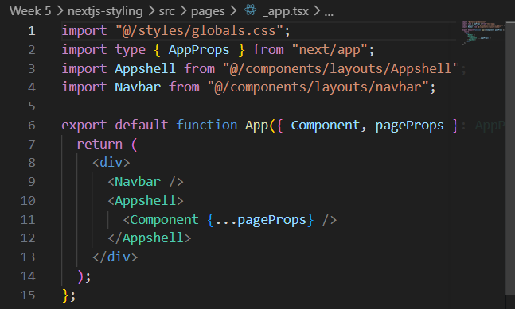

### 2. CSS Module (Local Scope)
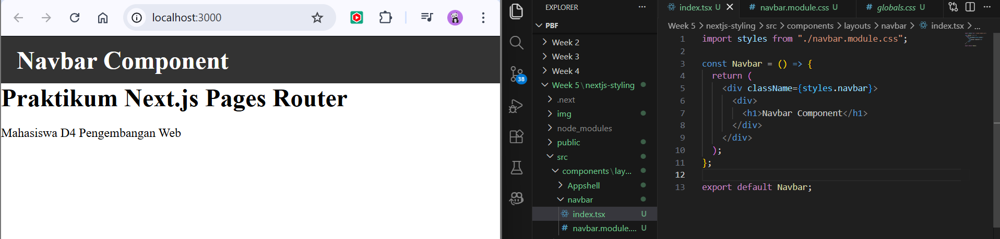

### 3. Styling for Pages (CSS Module)
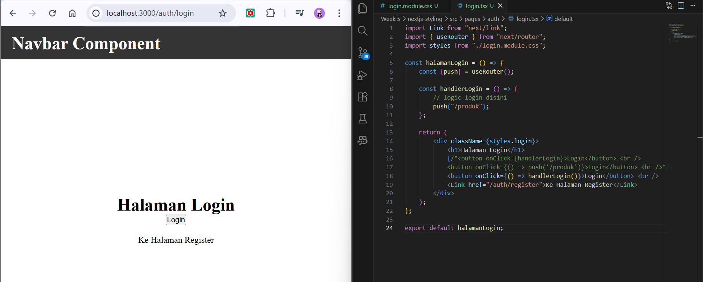

### 4. Conditional Rendering Navbar (Tanpa Navbar di Login) 
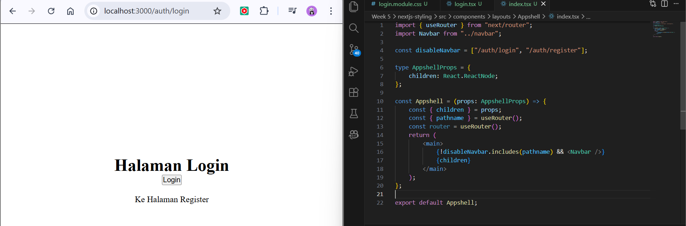

### 5. Refactoring Project Structure (Best Practice) 
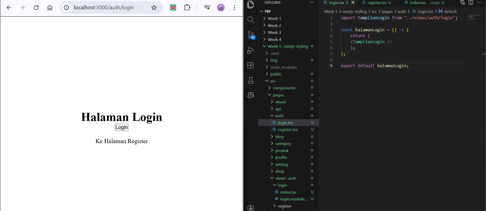

### 6. Inline Styling (CSS-in-JS) 
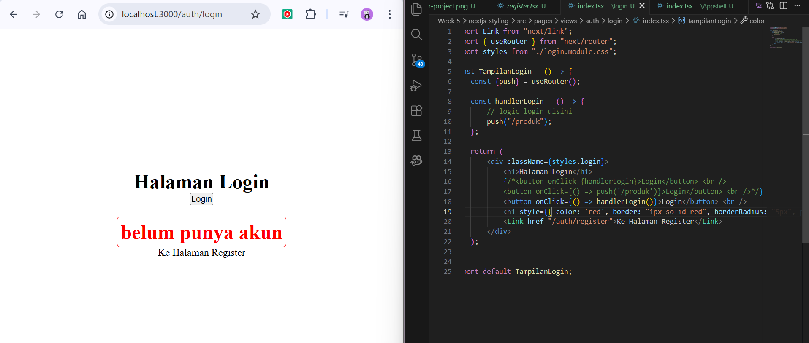

### 7. Global CSS + CSS Module Combination
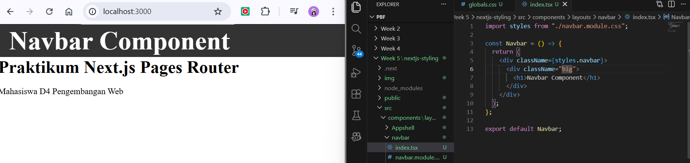

### 8. SCSS (SASS) 
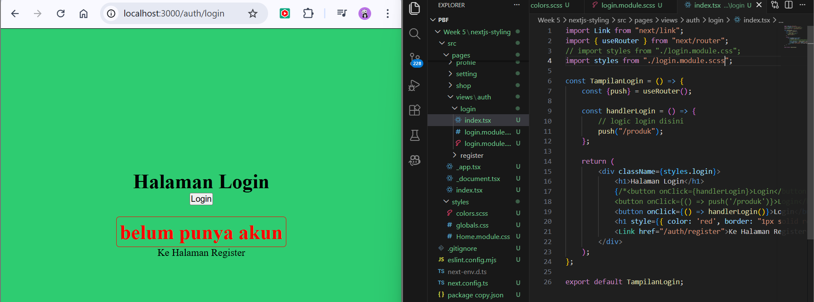

### 9. Tailwind CSS 
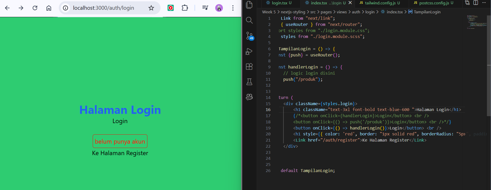

## Practical Tasks
### Task 1
- Create a Register page
- Use CSS Modules

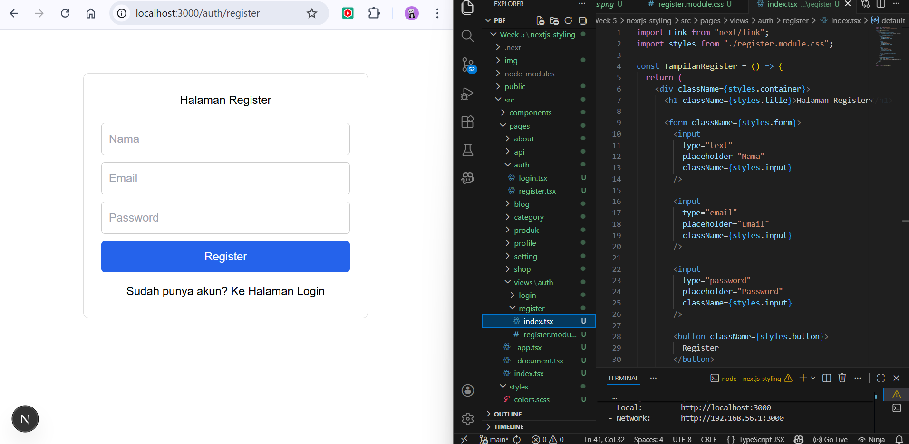

In this task, a Register page was created to allow users to access the registration interface. The styling of the page uses CSS Module so that the styles are scoped only to the Register component. This approach prevents style conflicts and keeps the code more modular and maintainable.

### Task 2
- Refactor the Product page into the views folder
- Separate the Hero Section and Main Section

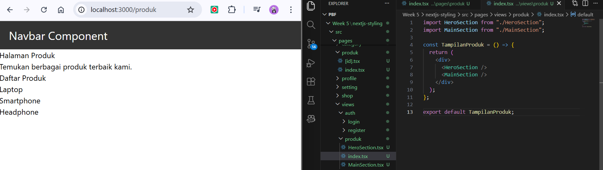

In this task, the Product page was refactored by moving the main logic to the views folder. The page was also divided into two components: Hero Section and Main Section. The Hero Section displays the main title and description, while the Main Section contains the product list. This separation improves code organization and readability.

### Task 3
- Apply Tailwind CSS
- Use at least 5 utility classes

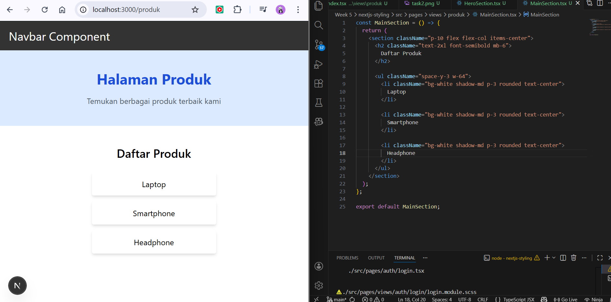

In this task, Tailwind CSS was applied to style the components using utility classes. Several classes such as bg-blue-100, text-3xl, font-bold, p-10, and shadow-md were used to create a simple and responsive layout.

## Reflection Questions
**1. When should we use CSS Module instead of Global CSS?**
| CSS Module                                                 | Global CSS                                           |
| ---------------------------------------------------------- | ---------------------------------------------------- |
| Used for styling specific components                       | Used for styling the entire application              |
| Prevents style conflicts because styles are scoped locally | Styles can affect all elements globally              |
| Suitable for reusable components                           | Suitable for basic styles like body, font, or layout |

In general, CSS Module should be used when styling individual components, while Global CSS is used for general styles applied across the whole application.

**2. What are the weaknesses of inline styling?**

One weakness of inline styling is that it can make the code harder to read and maintain, especially when the styling becomes complex. It also does not support advanced CSS features like pseudo-classes or media queries. Because of that, inline styling is usually only used for simple or temporary styles.

**3. Why is SCSS suitable for large-scale projects?**

SCSS is suitable for large projects because it provides better structure and organization for CSS. It supports features like nesting, variables, and reusable mixins. These features help developers manage complex styles more efficiently and keep the code easier to maintain.

**4. What are the advantages of Tailwind compared to traditional CSS?**
| Tailwind CSS                              | Traditional CSS                     |
| ----------------------------------------- | ----------------------------------- |
| Uses utility classes directly in HTML/JSX | Requires writing separate CSS files |
| Faster development                        | Takes more time to write styles     |
| Consistent design system                  | Styles may become inconsistent      |
| Less CSS code to maintain                 | CSS files can become very large     |

Overall, Tailwind CSS speeds up development and keeps styling consistent across the project.