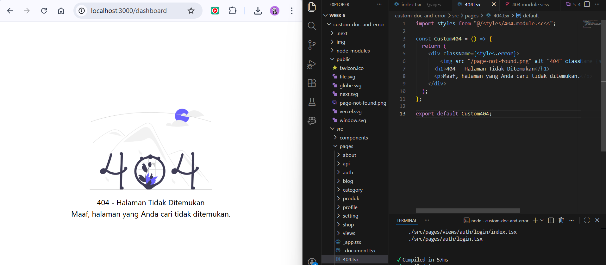
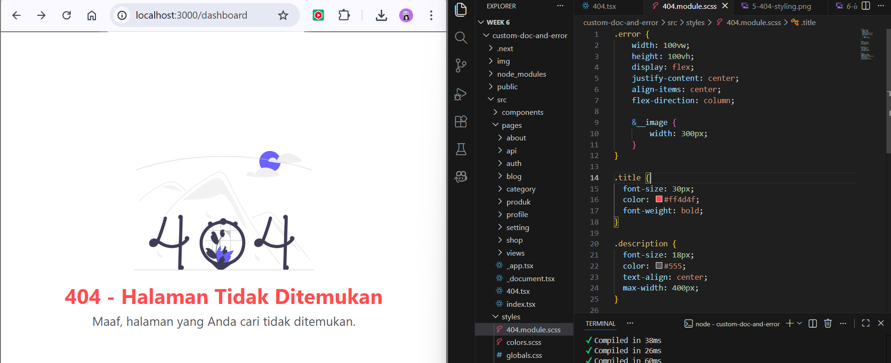
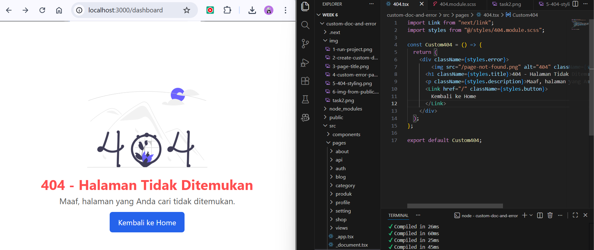

## Practicum Report

|  | Pemrograman Berbasis Framework 2026 |
|--|--|
| NIM |  2341720241|
| Nama |  Sherly Lutfi Azkiah Sulistyawati |
| Kelas | TI - 3I |
---

## Practicum Tasks
### Task 1

Add the following elements to the page:
- Page title
- Short description
- Illustration image

In this task, a custom 404 error page was created to inform users when a requested page cannot be found. The page includes a title, a short description, and an illustration image to make the error message clearer and more user-friendly.

### Task 2
- Customize the color, font, and layout of the 404 page.
- Ensure the Navbar does not appear on the 404 page.

The appearance of the 404 page was customized using CSS Module by adjusting colors, fonts, and layout. The Navbar was also hidden on the 404 page to keep the error page simple and focused.

### Task 3

Add a button:
- “Back to Home”
- Use Next.js navigation (Link).

A “Back to Home” button was added using the Next.js Link component. This button allows users to easily navigate back to the homepage without reloading the page.

## Reflection Questions
**1. What is the main function of _document.js?**

The main function of _document.js is to customize the overall HTML document structure in a Next.js application. It allows developers to modify the <html>, <head>, and <body> tags that wrap the entire application.

**2. Why is <title> not recommended inside _document.js?**

The <title> tag is not recommended in _document.js because page titles usually need to be dynamic and different for each page. In Next.js, the <title> should be defined using the Head component inside individual pages so that each page can have its own title.

**3. What is the difference between a regular page and a 404.js page?**

| Aspect  | Regular Page                                              | 404 Page                                                 |
| ------- | --------------------------------------------------------- | -------------------------------------------------------- |
| Purpose | Displays normal content for a specific route              | Displays an error when the requested page does not exist |
| Routing | Accessed through defined routes (e.g., `/about`, `/blog`) | Automatically shown when a route is not found            |
| Content | Contains application features or information              | Contains an error message and navigation option          |
| Example | `/profile`                                                | When visiting `/random-page`                             |

**4. Why does the public folder not need to be imported?**

The public folder in Next.js is used to store static assets such as images, icons, and files. Files inside this folder can be accessed directly through their URL path, so they do not need to be imported in the code.

Example: public/image.png

Can be accessed as: 