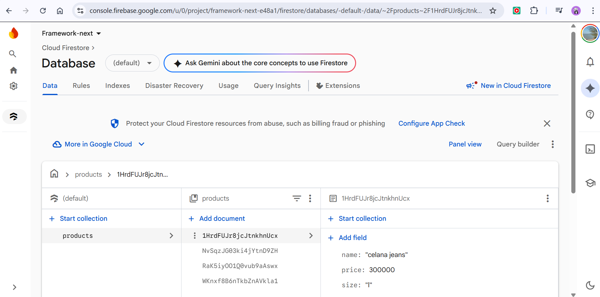
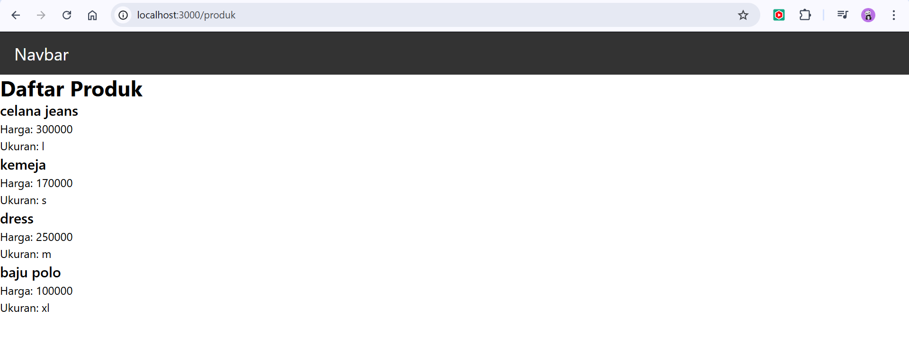
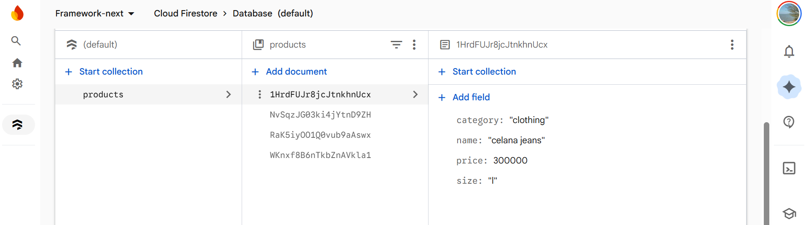
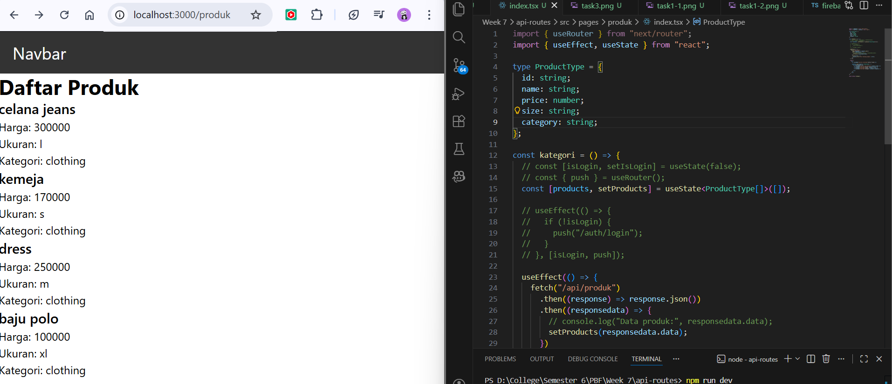
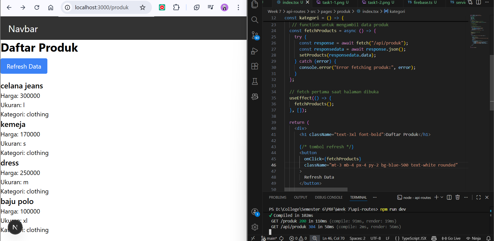

## Practicum Report

|  | Pemrograman Berbasis Framework 2026 |
|--|--|
| NIM |  2341720241|
| Nama |  Sherly Lutfi Azkiah Sulistyawati |
| Kelas | TI - 3I |
---

## Practicum Tasks
### Task 1
- Add at least 3 product data entries in Firestore.
- Make sure the data appears on the product page.

Three product records were added to the Firestore database. Each product contains the fields name, price, and size, and the data is displayed on the product page through the API route.

### Task 2
- Add a new field:
    - category
- Display the category field on the frontend.

A new field called category was added to each product in Firestore. The category data is then displayed on the frontend along with the product name, price, and size.

### Task 3
- Add a Refresh Data button.
- Use fetch to reload the data without refreshing the entire page.

A Refresh Data button was added to reload product data from the API. The button calls the fetch function again, allowing the product list to update dynamically without refreshing the entire page.

## Reflection Questions
**1. What is the function of API Routes in Next.js?**

API Routes in Next.js allow developers to create backend API endpoints directly inside a Next.js project. They enable the application to handle server-side logic such as fetching data from databases, processing requests, and returning responses in JSON format.

**2. Why should .env.local not be pushed to a repository?**

The .env.local file usually contains sensitive information, such as API keys, database credentials, and authentication secrets. If this file is pushed to a repository, especially a public one, the credentials could be exposed and misused by others.

**3. What is the difference between static data and dynamic data?**

| Aspect     | Static Data                          | Dynamic Data                                  |
| ---------- | ------------------------------------ | --------------------------------------------- |
| Definition | Data that does not change frequently | Data that can change over time                |
| Source     | Usually written directly in the code | Retrieved from APIs or databases              |
| Update     | Requires modifying the code          | Can update automatically from the data source |
| Example    | Hardcoded product list               | Data from Firebase Firestore                  |

Static data is usually defined directly in the code and does not change unless the developer manually edits the source code. In contrast, dynamic data comes from external sources such as databases or APIs, allowing the application to update the information automatically without modifying the code.

**4. Why is Next.js called a fullstack framework?**

Next.js is called a fullstack framework because it supports both frontend and backend development in a single project. Developers can build user interfaces with React while also creating backend logic such as API Routes, server-side rendering, and database connections within the same framework.