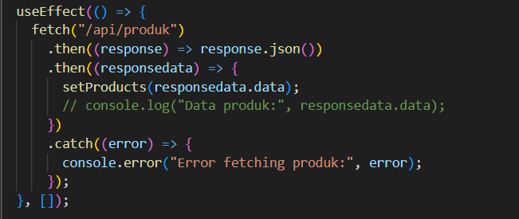
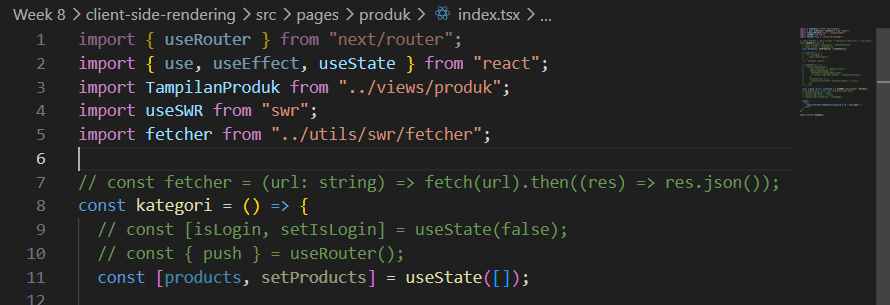
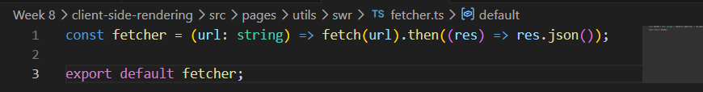

## Practicum Report

|  | Pemrograman Berbasis Framework 2026 |
|--|--|
| NIM |  2341720241|
| Nama |  Sherly Lutfi Azkiah Sulistyawati |
| Kelas | TI - 3I |
---

## Practicum Tasks
### Task 1
Explain the differences between:
- Client Side Rendering (CSR)
- Server Side Rendering (SSR)
- Static Site Generation (SSG)

| Aspect             | Client Side Rendering (CSR) | Server Side Rendering (SSR)   | Static Site Generation (SSG) |
| ------------------ | --------------------------- | ----------------------------- | ---------------------------- |
| Rendering Location | Browser (client)            | Server                        | Build time                   |
| Initial HTML       | Mostly empty                | Fully rendered HTML           | Pre-generated HTML           |
| Data Fetching      | After page loads            | Before sending page to client | During build process         |
| Performance        | Slower first load           | Faster first load             | Very fast                    |
| Use Case           | Interactive dashboards      | Dynamic pages                 | Static content (blog, docs)  |

Explanation
- Client Side Rendering (CSR) renders the page in the browser. The server sends a minimal HTML file and JavaScript, then the browser fetches data and renders the UI.
- Server Side Rendering (SSR) renders the page on the server before sending it to the browser, so the user receives a fully rendered HTML page.
- Static Site Generation (SSG) generates the HTML at build time. The page becomes a static file and can be served very quickly.

### Task 2
Create a Product Page with:
- Skeleton Loading 
- Animation

Skeleton loading is implemented using conditional rendering. When the products array is empty, skeleton placeholders are displayed to simulate the layout of the product cards. After the data is loaded, the skeleton is replaced with the actual product information.

### Task 3
Refactor Code from useEffect to SWR

Before:

After:

SWR simplifies data fetching in Next.js. It automatically handles caching, revalidation, loading states, and error handling. Compared to manual useEffect, SWR makes the code cleaner and more efficient.
