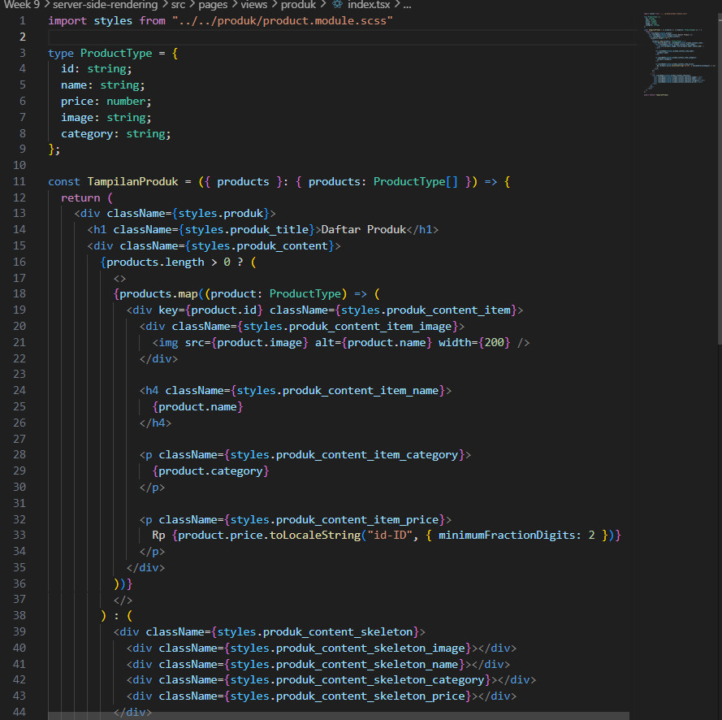
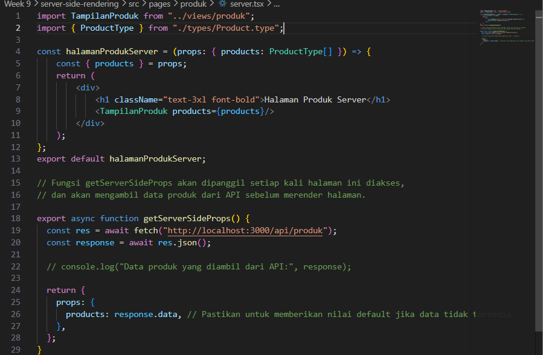
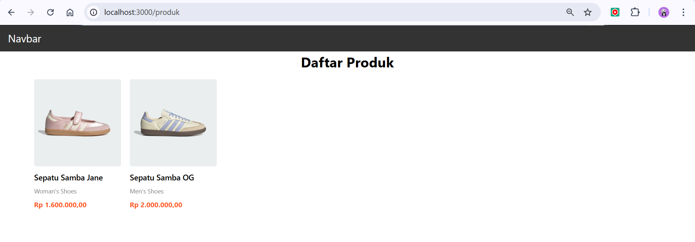
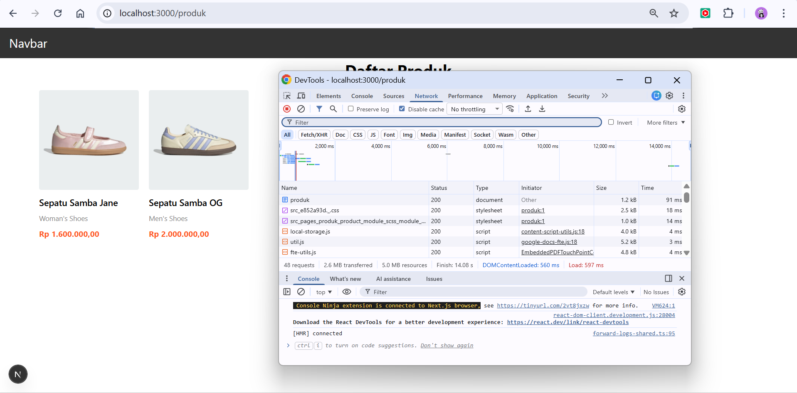
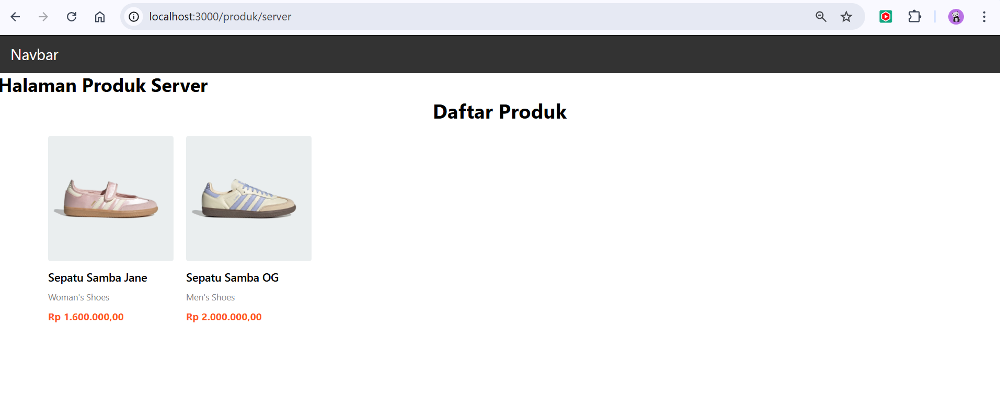
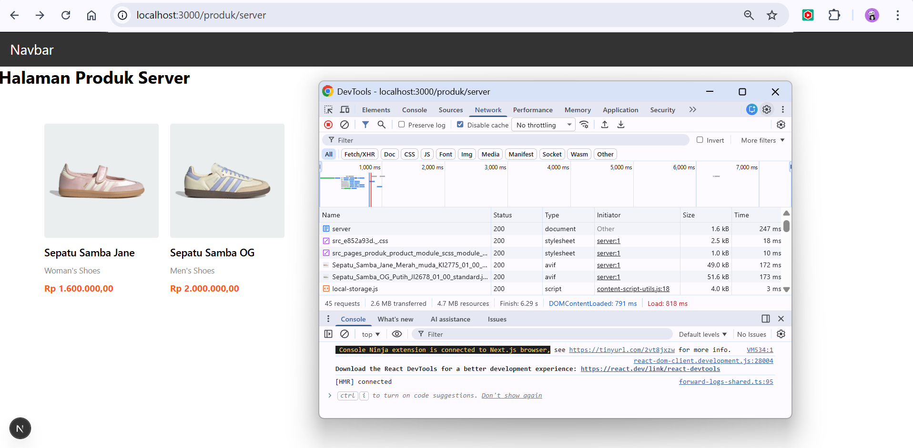

## Practicum Report

|  | Pemrograman Berbasis Framework 2026 |
|--|--|
| NIM |  2341720241|
| Nama |  Sherly Lutfi Azkiah Sulistyawati |
| Kelas | TI - 3I |
---

## Practicum Tasks
### Task 1
Create two pages:
- /products → Client Side Rendering (CSR)
- /products/server → Server Side Rendering (SSR)

CSR

SSR

### Task 2
Document the following:
- Screenshot of CSR page
- Screenshot of SSR page
- Difference in Network Tab
- Difference in View Sourceproduct information.

CSR

- Page

- Network Tab

SSR

- Page

- Network Tab
